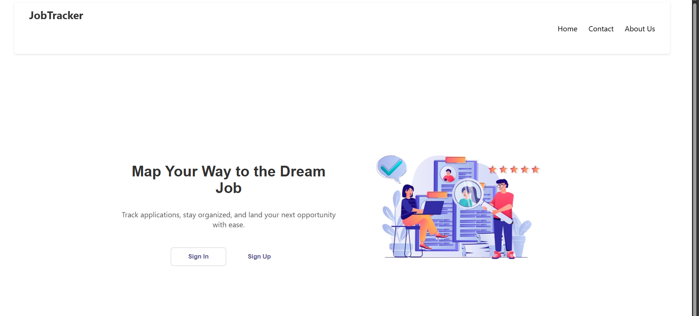

## Project Title

Job Application Tracker

## Description

Web application that allows job applicants to track the number of jobs they’ve applied for, which will help them assess how many applications are successful, pending and rejected.

## Features

-create accounts
-authentication
-create,read,update and delete jobs 
-view the status 

## Executing Program

npm install
npm run dev

## Screenshots/Demo

